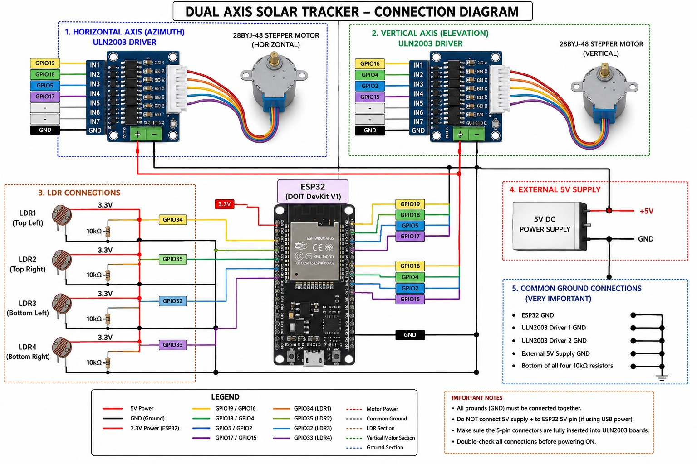
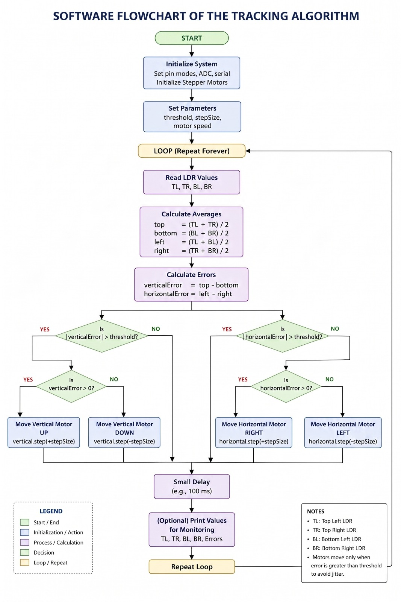
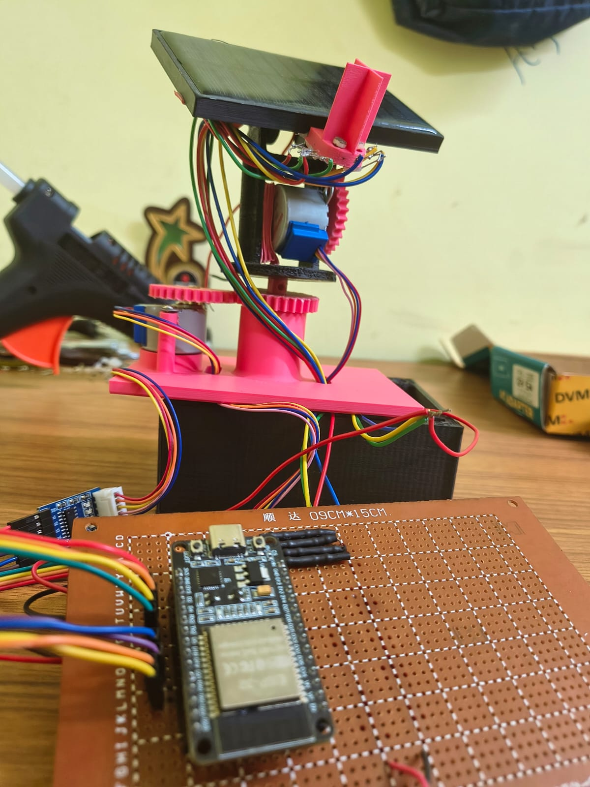

# ☀️ Dual-Axis Solar Tracker using ESP32

## Circuit Diagram


## Software Flowchart


<p align="center">
  
</p>

<p align="center">
  
  
  
  
</p>

---

# 📖 Overview

This project presents a **Dual-Axis Solar Tracker** built using an **ESP32 microcontroller**, **four LDR (Light Dependent Resistor) sensors**, and **two 28BYJ-48 stepper motors**.

The system continuously detects the direction of maximum sunlight and automatically rotates the solar panel along both the **horizontal (azimuth)** and **vertical (elevation)** axes. Compared to a fixed solar panel, this approach improves solar energy collection by keeping the panel aligned with the strongest light source throughout the day.

---

# ✨ Features

- 🌞 Automatic sunlight tracking
- ↔️ Horizontal (Azimuth) movement
- ↕️ Vertical (Elevation) movement
- 🔦 Four LDR-based light sensing
- ⚡ ESP32-based control system
- 🔄 Stepper motor positioning
- 🔌 External 5V motor supply
- 💻 Arduino IDE compatible
- 📊 Serial Monitor debugging

---

# 🛠 Hardware Components

| Component | Quantity |
|-----------|---------:|
| ESP32 DevKit V1 | 1 |
| 28BYJ-48 Stepper Motor | 2 |
| ULN2003 Driver Module | 2 |
| LDR Sensor | 4 |
| 10kΩ Resistor | 4 |
| Mini Solar Panel | 1 |
| External 5V Power Supply | 1 |
| Connecting Wires | As Required |

---

# ⚙️ Software Used

- Arduino IDE
- ESP32 Arduino Board Package
- Arduino C++

---

# 🔌 Pin Configuration

## LDR Connections

| ESP32 Pin | LDR Position |
|-----------|--------------|
| GPIO34 | Top Left |
| GPIO35 | Top Right |
| GPIO32 | Bottom Left |
| GPIO33 | Bottom Right |

## Horizontal Stepper Motor

| ESP32 | ULN2003 |
|--------|----------|
| GPIO19 | IN1 |
| GPIO18 | IN2 |
| GPIO5 | IN3 |
| GPIO17 | IN4 |

## Vertical Stepper Motor

| ESP32 | ULN2003 |
|--------|----------|
| GPIO16 | IN1 |
| GPIO4 | IN2 |
| GPIO2 | IN3 |
| GPIO15 | IN4 |

---

# 🧠 Working Principle

The system uses four LDR sensors placed at the four corners of the solar panel.

The ESP32 continuously reads all four sensor values.

It calculates:

- Left = Top Left + Bottom Left
- Right = Top Right + Bottom Right
- Top = Top Left + Top Right
- Bottom = Bottom Left + Bottom Right

The controller compares these values:

- If **Left > Right**, the horizontal motor rotates toward the left.
- If **Right > Left**, the horizontal motor rotates toward the right.
- If **Top > Bottom**, the vertical motor moves upward.
- If **Bottom > Top**, the vertical motor moves downward.

Once all four sensor readings are nearly balanced, the motors stop, ensuring the panel faces the strongest light source.

---

# 📂 Repository Structure

```
Dual-Axis-Solar-Tracker-ESP32
│
├── code/
├── report/
├── images/
├── circuit_diagram/
├── flowchart/
├── STL_Files/
├── docs/
├── datasheets/
├── presentation/
├── video/
│
├── README.md
├── LICENSE
└── .gitignore
```

---

# 📷 Project Images

## Complete Project

> Add an image named:

```
images/Complete_Project.jpg
```

## Circuit Diagram

> Add:

```
Connection_Diagram.jpg
```

## Software Flowchart

> Add:

```
Software_Flowchart.jpg
```

---

# 🚀 How to Run

1. Clone or download this repository.
2. Open `Main_Code.ino` using Arduino IDE.
3. Install the ESP32 board package.
4. Select **ESP32 Dev Module**.
5. Connect the ESP32 via USB.
6. Upload the code.
7. Power the ULN2003 driver modules using an external 5V supply.
8. Open the Serial Monitor at **115200 baud**.
9. Shine a light on different LDRs and observe the panel tracking.

---

# 📊 Test Results

| Test | Result |
|------|--------|
| Left Tracking | ✅ Pass |
| Right Tracking | ✅ Pass |
| Upward Tracking | ✅ Pass |
| Downward Tracking | ✅ Pass |
| Complete Tracking | ✅ Pass |

---

# 📈 Future Improvements

- ESP32 Wi-Fi Monitoring
- Blynk Dashboard
- MQTT Integration
- ThingSpeak Cloud
- Automatic East Reset
- MPPT Integration
- Battery Monitoring
- Dust Cleaning Mechanism
- Rain Sensor
- Wind Protection
- AI-based Sun Position Prediction

---

# 📹 Demonstration Video

Place your project demonstration video in the `video` folder or provide a YouTube link here.

Example:

```
https://youtu.be/_2enJQ5KMcw
```

---

# 📚 Documentation

Detailed documentation is available in the **docs** folder.

- Components List
- Pin Configuration
- Working Principle
- Project Specifications
- Testing Results
- Future Improvements

---

# 👨‍💻 Author

**Krishanu Biswas**

B.Tech in Electronics and Communication Engineering (ECE)

Cooch Behar Government Engineering College

GitHub: https://github.com/KrishanuBiswas

---

# 📜 License

This project is released under the **MIT License**.

Feel free to use, modify, and improve this project with proper attribution.

---

# ⭐ Support

If you found this project useful:

⭐ Star this repository

🍴 Fork the repository

📢 Share it with others

---

<p align="center">
Made with ❤️ using ESP32 
</p>
